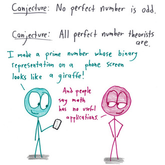
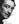
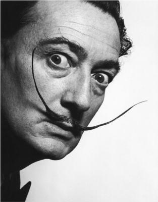
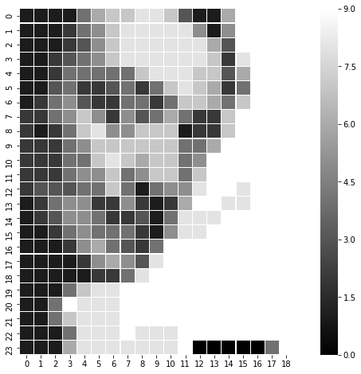
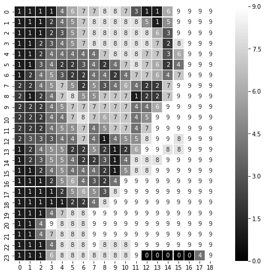

Paint with prime numbers
----------------------------

A prime number which looks like salvador dali
++++++++++++++++++++++++++++++++++++++++++++++++++++++++

   number theorist

Prime numbers are ubiquitous. Prime numbers are fun. Prime numbers have
many uses.

But the most important use of prime numners is in art. If you haven't
read `prime numbers which look like
giraffe <https://www.agiliq.com/blog/2018/01/prime-number-binary-trex/>`__,
you should read it, but today we are doing something more fun. Finding
prime numbers which look like famous artists.

We will use Salvador Dali, my favorite surrealist, as the guinea pig.

We will use the below striking image of Dali as our source image.
|Salvador Dali|

This is too large (on my machine) to parse as a number, so we will
resize it to 24x24 grayscale image. It looks like this

   Salvador Dali

Much smaller but still recognizable as Salvador. Lets get to work.

.. code:: ipython3

    # We will read the image as a numpy array.
    # Grayscale images are read as numpy array of spape (X, Y)
    # Each element is a value between [0, 1]
    # We map these to integere between [0, 9], so that each pixel represents a digit

    import numpy as np
    import matplotlib.image as mpimg
    img = mpimg.imread('salvador.png')
    quantized_data = np.reshape(
        np.fromiter((round(el*9) for el in img.flatten()), dtype=int),
        img.shape
    )

.. code:: ipython3

    # Lets look at quantized_data
    quantized_data

.. parsed-literal::

    array([[1, 1, 1, 1, 4, 6, 7, 7, 8, 8, 7, 3, 1, 1, 6, 9, 9, 9, 9],
           [1, 1, 1, 2, 4, 5, 7, 8, 8, 8, 8, 8, 5, 1, 5, 9, 9, 9, 9],
           [1, 1, 1, 2, 3, 5, 7, 8, 8, 8, 8, 8, 8, 6, 3, 9, 9, 9, 9],
           [1, 1, 2, 3, 4, 5, 7, 8, 8, 8, 8, 8, 8, 7, 2, 8, 9, 9, 9],
           [1, 1, 2, 4, 4, 4, 4, 4, 7, 8, 8, 8, 7, 7, 3, 6, 9, 9, 9],
           [1, 1, 3, 4, 2, 2, 3, 4, 2, 4, 7, 8, 7, 6, 2, 4, 9, 9, 9],
           [1, 2, 4, 5, 3, 2, 2, 4, 4, 2, 4, 7, 7, 6, 4, 7, 9, 9, 9],
           [2, 2, 4, 5, 7, 5, 2, 5, 3, 4, 6, 4, 2, 2, 7, 9, 9, 9, 9],
           [2, 1, 2, 4, 7, 8, 5, 5, 7, 7, 7, 1, 2, 2, 7, 9, 9, 9, 9],
           [2, 2, 2, 4, 5, 7, 7, 7, 7, 7, 7, 4, 4, 6, 9, 9, 9, 9, 9],
           [2, 2, 2, 4, 4, 7, 8, 7, 6, 7, 7, 4, 5, 9, 9, 9, 9, 9, 9],
           [2, 2, 2, 4, 5, 5, 7, 4, 5, 7, 7, 4, 7, 9, 9, 9, 9, 9, 9],
           [2, 3, 3, 3, 4, 4, 7, 4, 1, 4, 5, 5, 8, 9, 9, 8, 9, 9, 9],
           [1, 2, 4, 5, 5, 2, 2, 5, 2, 1, 2, 6, 9, 9, 8, 8, 9, 9, 9],
           [1, 2, 3, 5, 5, 4, 2, 2, 3, 1, 4, 8, 8, 8, 9, 9, 9, 9, 9],
           [1, 1, 2, 4, 5, 4, 4, 4, 2, 1, 5, 8, 8, 9, 9, 9, 9, 9, 9],
           [1, 1, 1, 2, 5, 6, 4, 3, 2, 4, 9, 9, 9, 9, 9, 9, 9, 9, 9],
           [1, 1, 1, 1, 2, 5, 6, 5, 3, 8, 9, 9, 9, 9, 9, 9, 9, 9, 9],
           [1, 1, 1, 1, 1, 2, 2, 4, 8, 9, 9, 9, 9, 9, 9, 9, 9, 9, 9],
           [1, 1, 1, 4, 7, 8, 8, 9, 9, 9, 9, 9, 9, 9, 9, 9, 9, 9, 9],
           [1, 1, 4, 9, 8, 8, 8, 9, 9, 9, 9, 9, 9, 9, 9, 9, 9, 9, 9],
           [1, 1, 4, 7, 8, 8, 8, 9, 9, 9, 9, 9, 9, 9, 9, 9, 9, 9, 9],
           [1, 1, 1, 4, 8, 8, 8, 9, 8, 8, 8, 9, 9, 9, 9, 9, 9, 9, 9],
           [1, 1, 1, 6, 8, 8, 8, 8, 8, 8, 8, 8, 9, 9, 9, 9, 9, 9, 9]])

.. code:: ipython3

    # We will convert it to integer with each element representing a digit in our number.
    # I don't like the code below but it is the best I could come up with
    np.set_printoptions(linewidth=10000)
    np.set_printoptions(threshold=np.nan)
    number = int(np.array2string(quantized_data.flatten())[1:-1].replace(" ", ""))

.. code:: ipython3

    # Lets look at the number
    number

.. parsed-literal::

    111146778873116999911124578888851599991112357888888639999112345788888872899911244444788877369991134223424787624999124532244247764799922457525346422799992124785577712279999222457777774469999922244787677459999992224557457747999999233344741455899899912455225212699889991235542231488899999112454442158899999911125643249999999991111256538999999999111112248999999999911147889999999999991149888999999999999114788899999999999911148889888999999991116888888889999999

.. code:: ipython3

    # We want to find a prime number close to this number
    # We will use Miller-rabin fast probilistic testing to check primes
    # And keep iterating until we find one

    from random import randrange

    def find_next_prime(number):
        "Given a number, find next prime number"
        number = number | 1  # ensure last bit is 1
        while(True):
            is_prime = miller_rabin(number)
            if is_prime:
                break
            number += 2
        return number

    def miller_rabin(n, k=10):
        if n == 2:
            return True
        if not n & 1:
            return False

        def check(a, s, d, n):
            x = pow(a, d, n)
            if x == 1:
                return True
            for i in range(s - 1):
                if x == n - 1:
                    return True
                x = pow(x, 2, n)
            return x == n - 1

        s = 0
        d = n - 1

        while d % 2 == 0:
            d >>= 1
            s += 1

        for i in range(k):
            a = randrange(2, n - 1)
            if not check(a, s, d, n):
                return False
        return True

    prime = find_next_prime(number)
    prime

.. parsed-literal::

    111146778873116999911124578888851599991112357888888639999112345788888872899911244444788877369991134223424787624999124532244247764799922457525346422799992124785577712279999222457777774469999922244787677459999992224557457747999999233344741455899899912455225212699889991235542231488899999112454442158899999911125643249999999991111256538999999999111112248999999999911147889999999999991149888999999999999114788899999999999911148889888999999991116888888890000049

.. code:: ipython3

    # Now reconvert the prime to a gigit 2d array
    # Maintain the same size as originally read image
    prime_digit_array = np.resize(
        np.array(list(str(prime)), dtype=int),
        img.shape
    )

.. code:: ipython3

    import seaborn as sns
    ax = sns.heatmap(
                    prime_digit_array,
                    linewidth=0.1, square=True, cmap='gray', annot=False)
    ax

.. parsed-literal::

    <matplotlib.axes._subplots.AxesSubplot at 0x10e8cc978>

Slightly surreal, but still distinctly Salvador Dali. We have found the
prime number

111146778873116999911124578888851599991112357888888639999112345788888872899911244444788877369991134223424787624999124532244247764799922457525346422799992124785577712279999222457777774469999922244787677459999992224557457747999999233344741455899899912455225212699889991235542231488899999112454442158899999911125643249999999991111256538999999999111112248999999999911147889999999999991149888999999999999114788899999999999911148889888999999991116888888890000049

Which when plotted in 2d looks like our Favorite Artist.

.. code:: ipython3

    # If you want to play around with it,
    # Here is a reusabel class you can use to generate the primes and display them.
    # It works best with grayscale image with distinctive features.

    import numpy as np
    from random import randrange
    import matplotlib.image as mpimg
    import seaborn as sns

    class PaintByPrimeNumbers:
        """
        Takes a grayscale image and finds a prime which looks like the target image
        """
        def __init__(self, image_name):
            self.image_name = image_name
            img = mpimg.imread(image_name)
            quantized_data = np.reshape(np.fromiter((round(el*9) for el in img.flatten()), dtype=int), img.shape)
            self.number = self.get_number_from_digitarray(quantized_data)
            self._prime = None
            self.img = img

        @property
        def prime(self):
            if self._prime:
                return self._prime
            else:
                self._prime = self.find_next_prime(self.number)
                return self._prime

        def display(self, annot=False, cmap="gray"):
            ax = sns.heatmap(
                    np.resize(
                        np.array(list(str(self.prime)), dtype=int),
                        self.img.shape
                    ),
                    linewidth=0.1, square=True, cmap=cmap, annot=annot)

        def get_number_from_digitarray(cls, digitarray):
            np.set_printoptions(linewidth=10000)
            np.set_printoptions(threshold=np.nan)
            number = int(np.array2string(digitarray.flatten())[1:-1].replace(" ", ""))
            return number

        @classmethod
        def find_next_prime(cls, number):
            "Given a number, find next prime number"
            number = number | 1  # ensure last bit is 1
            while(True):
                is_prime = cls.miller_rabin(number)
                if is_prime:
                    break
                number += 2
            return number

        @classmethod
        def miller_rabin(cls, n, k=10):
            if n == 2:
                return True
            if not n & 1:
                return False

            def check(a, s, d, n):
                x = pow(a, d, n)
                if x == 1:
                    return True
                for i in range(s - 1):
                    if x == n - 1:
                        return True
                    x = pow(x, 2, n)
                return x == n - 1

            s = 0
            d = n - 1

            while d % 2 == 0:
                d >>= 1
                s += 1

            for i in range(k):
                a = randrange(2, n - 1)
                if not check(a, s, d, n):
                    return False
            return True

.. code:: ipython3

    # And lets use our class
    %pylab inline
    pylab.rcParams['figure.figsize'] = (12, 8)
    salvador_dali = PaintByPrimeNumbers('./salvador.png')

.. parsed-literal::

    Populating the interactive namespace from numpy and matplotlib

.. parsed-literal::

    /Users/shabda/.virtualenvs/yanny_vs_laurel/lib/python3.6/site-packages/IPython/core/magics/pylab.py:160: UserWarning: pylab import has clobbered these variables: ['number']
    `%matplotlib` prevents importing * from pylab and numpy
      "\n`%matplotlib` prevents importing * from pylab and numpy"

.. code:: ipython3

    salvador_dali.display()

.. code:: ipython3

    # And lets see with the numbers inline
    salvador_dali.display(annot=True)

A prime number whose binary representation looks like a giraffe
++++++++++++++++++++++++++++++++++++++++++++++++++++++++++++++++

.. figure:: https://raw.githubusercontent.com/shabda/experiments/master/prime_dinos/odd-number-theorists.jpg
   :alt: Odd Number Theorists

   Odd Number Theorists

First, here is a prime number whose binary representation is a T-Rex.

.. raw:: html

   

Math with bad drawings `asked`_ for a prime number whose binary
representation is a giraffe. This lead to discussion on `Math.reddit`_
and `Hacker news`_ which led to finding such a prime number.

::

   342581792649127676198127791406119644054852809184750511204770992210601825938383173228625368612512343524580568135765381129832784929140287102447656231670490278371618738040053550924844754083137995849927287014555199009052294292243605111352278964229602623894816760629354416193979550552423279842373621548435137856781153105076831681645952473068169294190544029391463758663828828100567003458546392021905815042131115480711892076216081858013250696070743624005842779807059777397154653840706692288630135185563366228931093496037459868457738024280865863648682544327375771172685872176976999577303715645442779935499071380556380855234358517399907184246818275843840363379983214925406281243183361618849192180391506653641933784053451121171160334712857092937535606122822893204604775038632348974223351004456787673186165100098223897371450275291114458983950607846718107603195397991880820766444935587675531082421404505700110617860358142315360174185418283092141238404865012380329781867103175076882601367389664213176688432343205501275425887396821357210158983064167712232404771958406106398750988506833703615072967113838953

You can see the binary representation on reddit.

As Nathaniel Borenstein `said`_
``It should be noted that no ethically-trained software engineer would ever consent to write a DestroyBaghdad procedure. Basic professional ethics would instead require him to write a DestroyCity procedure, to which Baghdad could be given as a parameter.``

So the obvious next step is to generalize this is to program which can
take an image and find a primary number whose binary representation is
the image.

We run this for an Argentinosaurus image

::

   python prime_dinosaur.py -f ~/Downloads/argentinosaurus.jpg -s 40

Which gives us

.. raw:: html

   

How does this work?
~~~~~~~~~~~~~~~~~~~

-  We read the image and convert to desired size
-  The image data is converted to monochrome and pixels darker (lower)
   than a threshold are converted 1, rest pixels are zero.
-  This data is read in in a numpy array
-  This 2d array is flattened, and treated as a bitarray to get a number
-  We then start incrementing the number until we get a prime.
-  The primality is tested using the Miller Rabin test.
-  When such a number is found

.. _asked: https://mathwithbaddrawings.com/2017/10/09/insatiable-for-updates/
.. _Math.reddit: https://www.reddit.com/r/math/comments/7qpfls/does_there_exist_a_prime_number_whose/
.. _Hacker news: https://news.ycombinator.com/item?id=16192608
.. _said: https://en.wikiquote.org/wiki/Nathaniel_Borenstein
